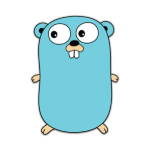
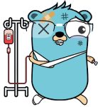

# How to use Golang

## Purpose


When at first I decided to learn Golang I looked for books and courses that help me into a fast learning approach. However I didn't want to learn only to write Golang code. I really wanted to develop apps, tools or whatever and I needed a bigger scope. I wanted to learn software engineering with this new (for me) programming language.

This repository collect and resume (from my point of view) some important concepts to keep in mind about Go.

## Index
- [Overview](#overview)
- [Packaging best practices](#packaging)
- [S.O.L.I.D](#solid)
- [Testing](#testing)
- [Concurrency](#concurrency)
- [Error handling](#error)
- [Modules](#modules)
- [Grpc API](#grpc)

## <a name="overview">Overview</a> [&#8593;](#index) 


Go, also commonly referred to as Golang, is a programming language developed at Google in 2007 by Robert Griesemer, Rob Pike, and Ken Thompson to improve programming productivity in an era of multicore, networked machines and large codebases.

It is a statically typed language with syntax loosely derived from that of C, adding garbage collection, type safety, some dynamic-typing capabilities, additional built-in types such as variable-length arrays & key-value maps, and a large standard library.

Also **it is an object-based programming language, not an object-oriented programming** language such as Java or C++. That means does not support classes. However, it does support the concepts of interfaces and structs.

There are a lot of material to learning Go syntax such as Effective Go book or even greats cheat sheets that resume the principal rules.

https://golang.org/doc/effective_go

https://devhints.io/go

https://github.com/a8m/golang-cheat-sheet

However, in these pages we will not focus on how to write it, but on how to use it correctly.

## <a name="packaging">Packaging best practices</a> [&#8593;](#index) 


Some recommended packaging rules that we should follow:

- Short and concises names 
- Avoid same package and variable/function names
- One folder, one package (except _test package)
- Avoid circular imports
- Take care with DRY pattern (it can break the previous rule)
- Use alias when it be necessary

They will be very useful to organizing our source code.

## <a name="solid">S.O.L.I.D</a> [&#8593;](#index) 


As with other programming languages, it is important to know how to write code efficiently and easily. Because of that, one of the first things I focused on was how to apply the basic principles of SOLID.

As we explained before, Go is not object-oriented programming and so these principles can have some nuances.

### Single Responsibility

It means that your struct must only have one responsibility. It also means that when you create your struct, you should look at 3 things :

- Is my method a behavior of my struct? (Is this behavior the Single Responsibility of my struct?)
- Is my struct tightly coupled with another struct?
- Could my method be applied differently?

As we can see in the next example, we have a robot with different features:

> solid/srp.go
```go
type robot struct {
	wheels  int
	sensors int
}

func (r robot) move() {
	//do staff
	fmt.Println("Go go go")
}

func (r robot) askWeather() string {
	//do staff
	return "Raining"
}
```

To apply this principle it is better to separate those functions into different components.

### Open/Close

Golang ensure a package not be able to modify the behavior of the types that are exported by other packages. However it can still access and mutate any fields defined by it (including private ones)

Additionally, it does not support inheritance to extends existing code. Composition is the only viable approach for extensions.

> solid/ocp.go
```go
type sword struct {
	name string
}

func (sword) Damage() int {
	return 30
}
...
type enchantedSword struct {
	sword
}

func (es enchantedSword) Damage() int {
	return 55
}
```

In this case we can call `func Damage()` and each structs will call his own method.

We can see, as we commented before, that we can access and modify sword private fields from enchantedSword struct methods.

```go
func (es *enchantedSword) rename(n string) {
	fmt.Println("Renaming sword")
	es.name = n
}
```

And finally, because inherance doesn't exists, if we call `enchantedSword.String()` , this method will recall `func (sword) Damage()` instead of `func (es enchantedSword) Damage()`.

We can check this in the results of the main function.

### Liskov Substitution

Golang does not support the concept of classes or inheritance but instead relies on interfaces as the means for facilitating type substitutions.

Interfaces are implicit. One object can be used in place of a interface if its method set contains methods whose name and signature match the ones defined by the interface.

> solid/lsp.go
```go
type car interface {
	Run()
}

type mercedes struct{}

func (mercedes) Run() {
	fmt.Println("Running with a Mercedes")
}

type fiat struct{}

func (fiat) Run() {
	fmt.Println("Running with a Fiat")
}
```

### Interface Segregation

In Go, the application of the interface segregation principle can refer to a process of isolating the behaviour required for a function to do its job.

The bigger the interface, the weaker the abstraction.

> solid/isp.go
```go
type forSale interface {
	getName() string
	getPrice() int
}
///////////////////
type cloth struct {
	name  string
	value int
}

func (c cloth) getName() string {
	return c.name
}

func (c cloth) getPrice() int {
	return c.value
}

func (c cloth) wear() {
	//do staff
}
///////////////////
type food struct {
	name       string
	valuePerUd int
	unit       int
	cookable   bool
}

func (f food) getName() string {
	return f.name
}

func (f food) getPrice() int {
	return f.valuePerUd * f.unit
}

func (f food) cook() {
	if f.cookable {
		fmt.Println("Cooking ", f.name)
	}
}
```

If you want to sell products, it is not necessary (and even bad practice) to implement `cook()` in a cloth struct or `wear()` in a food struct.

> A great rule of thumb for Go is accept interfaces, return structs – Jack Lindamood

### Dependency inversion

Your code should describe its dependencies in terms of interfaces, and those interfaces should be factored to describe only the behaviour those functions require. 

Because interfaces let Go programmers describe what their package provides–not how it does it. This is all just another way of saying “decoupling”, which is indeed the goal, because software that is loosely coupled is software that is easier to change.

> solid/dip.go
```go
type readable interface {
	read()
}

func main() {
    r := []readable{
	    book{pages: 256, weight: 102},
	    EPUB{pages: 133},
	    kindle{pages: 322},
    }

    for _, i := range r {
		i.read()
	}
}
```

[Examples](https://github.com/peterm85/golang/tree/main/solid)

## <a name="testing">Testing</a> [&#8593;](#index) 
We will see few aspects about testing as scopes, aproaches, patterns and different types of tests.

### Scopes


Surely anyone who has been in the programming world for a while will know these concepts. However I think it is important to have a picture of what these tests are like in the Go world.

#### Unit test

A unit test is the smallest possible bit of code that we can test.

In the process we will test each unit of an application in isolation to verify that its behavior conforms to a particular set of specifications.

All unit test files must be allocated alongside the code they test. Golang calculate the coverage about this kind of tests.

```
project
├──package1
    ├──file1.go
    ├──file1_test.go
    ...
```

#### Integration test

Integration tests ensures that different units (or services) interoperate correctly. 

This test files can not to be allocated alongside the code they test because may be composed by different packets from different folders.

```
project
├──package1
├──package2
│  ...
├──inttest
│   ├──file_test.go
│   ...
```

It needs high efforts to setting up.

When Golang calculate the coverage, it doesn't cover this kind of tests. However, there are some frameworks to help cover all the lines of code tested.

https://www.ory.sh/golang-go-code-coverage-accurate/

#### E2E/functional test

The primary purpose of functional testing is to ensure that the complete system is working as expected. To this end, functional tests are designed to model complex interaction scenarios that involve multiple system components.

A very common use case is to verify end-to-end correctness by simulating a user’s journey through the system. Indeed Golang is not good to doing this. Functional tests use to be written with Python, JS or Ruby or by a specific framework like Selenium.

Used on pre-release phases.

#### Benchmark

In times where performance is important, being able to benchmark how your program performs and analyze where potential bottlenecks are, is really valuable. By understanding where these bottlenecks lie, we can more effectively determine where to focus our efforts in order to improve the performance of our systems.

```go
func benchmarkCalculate(input int, b *testing.B) {
	for n := 0; n < b.N; n++ {
		Calculate(input)
	}
}

func BenchmarkCalculate100(b *testing.B)         { benchmarkCalculate(100, b) }
func BenchmarkCalculateNegative100(b *testing.B) { benchmarkCalculate(-100, b) }
func BenchmarkCalculateNegative1(b *testing.B)   { benchmarkCalculate(-1, b) }
```

Results:
```
goos: windows
goarch: amd64
pkg: github.com/peterm85/golang/tests
BenchmarkCalculate100-8                 1000000000               0.254 ns/op           0 B/op          0 allocs/op
BenchmarkCalculateNegative100-8         1000000000               0.252 ns/op           0 B/op          0 allocs/op
BenchmarkCalculateNegative1-8           1000000000               0.253 ns/op           0 B/op          0 allocs/op
```

### Approaches


In a very similar way to cibersecurity pentesting, we can analyze the behavior of our applications under these two approaches:

#### Black-box

It works under assumption that the underlying implementation details of the package that we test are totally opaque to the tester. As a result, we can only test the public interface or behaviour of a particular package and make sure it adheres to its advertised contract.

In Golang we will need to launch test from a different package, usually with the same name an the ‘_test’ suffix.

> tests/blackbox_test.go
```go
package tests_test

func Test_BB_DoStuffWithTestServer(t *testing.T) {
    ...
}
```

#### White-box

It assume that we have prior knowledge of the implementation details of a particular package. This allows the tester to either craft each test so that it exercises a particular code path within the package or to directly test the package’s internal implementation.

In Golang we will need to launch test from the same package.

> tests/unit_test.go
```go
package tests

func Test_WB_DoStuffWithTestServer(t *testing.T) {
    ...
}
```

### Patterns


Next, we will explain some useful patterns to help us test our code:

#### Stub

A stub is the simplest test pattern that we can use in our test. Typically they don’t contain any real logic, just provide fixed answers to calls or canned responses.

> tests/stub_test.go
```go
type stubClient struct{}

func (s *stubClient) Get(url string) (*http.Response, error) {
	return &http.Response{
		Body: ioutil.NopCloser(bytes.NewBufferString(`OK`)),
	}, nil
}
```

In this case, it always returns `OK`.

As we can see, it is really really important to use interfaces to delegate the implementation to our stub.

#### Spies

A spy is a stub that keeps a detailed log of all the methods that are invoked on it. For each method invocation, the spy records the arguments that were provided by the caller and makes them available for inspection by the test code.

> tests/spy_test.go
```go
type spyIClient struct {
	retries int
	entries []entry
	client  stubClient
}

func (p *spyIClient) Get(url string) (*http.Response, error) {
	r, er := p.client.Get(url)
	p.retries++
	p.entries = append(p.entries, entry{url, er})
	return r, er
}
```

In this case we can store all the error responses and number of calls.

#### Mocks

Mocks are stubs on steroids!

Mocks allow to specify, in a declarative way, the list of calls that the mock is expected to receive, their order and the expected argument values.

Furthermore mocks allow to specify return values for each method invocation, depending on the argument tuple provided by the method caller.

Often it is better to use them by external tools like gomock
https://github.com/golang/mock or httpmock https://pkg.go.dev/github.com/jarcoal/httpmock. I will use the first one in this example.

Running this command we can generate our mock to use it in our tests:
```shell
$mockgen -source='iclient.go' IClient -destination='mocks/mock_iclient.go'
```

```
project
├──package1
│   ├──mock
│      ├──mock_interface.go
│   ├──file_test.go
│   ...
```

Then we will just need to use the generated methods to declare and define what to expect:

> mock_test.go
```go
func Test_GoMock(t *testing.T) {
	//settingUp
	const url string = "http://localhost:1234"

	mockCtrl := gomock.NewController(t)
	defer mockCtrl.Finish()
	mockIClient := mocks.NewMockIClient(mockCtrl)
	// Expect Do to be called once with "http://localhost:1234" as parameter, and return http.Response from the mocked call.
	mockIClient.EXPECT().Get(url+"/some/path").Return(&http.Response{Body: ioutil.NopCloser(bytes.NewBufferString(`OK`))}, nil).Times(1)

	// given a Client & URL from our local test server
	api := API{
		Client:  mockIClient,
		BaseURL: url,
	}
	//when
	body, err := api.DoStuff()
	//then
	isOk(t, err)
	isEquals(t, []byte("OK"), body)
}
```

#### Fake objects

Fake objects contain a fully working implementation whose behaviour matches the objects that they are meant to substitute.

> tests/fakeobj_test.go
```go
type kvdbClient interface {
	Get(key string) ([]string, bool)
	Push(key string, values []string)
}

type inMemoryDB struct {
	m map[string][]string
}

func (im *inMemoryDB) Get(key string) ([]string, bool) {...}
func (im *inMemoryDB) Push(key string, values []string) {...}
```
In this case, we can use a in-memory key-value database instead of a fully database without installing anything.

But remember: Don’t use it on production!!

### Types


Golang support just two ways of making tests. We will talk about them, their combinations and some helper tools.

#### Table-driven

The format of a typical table-driven test consists of two distinct parts: the test case definition and the test-runner code.

> tests/tabledriven_test.go
```go
func Test_Sum(t *testing.T) {

	//Case definition
	specs := []struct {
		descr  string
		inputX int
		inputY int
		exp    int
	}{
		{descr: "All positive inputs", inputX: 5, inputY: 8, exp: 13},
		{descr: "Positive and negative inputs", inputX: 5, inputY: -3, exp: 2},
		{descr: "Negative results", inputX: 5, inputY: -12, exp: -7},
		{descr: "All negative inputs", inputX: -5, inputY: -12, exp: -17},
		//{descr: "Wrong use case", inputX: 2, inputY: 10, exp: 15},
	}

	//Test-runner code
	for spectIndex, spec := range specs {
		if got := Sum(spec.inputX, spec.inputY); got != spec.exp {
			t.Errorf("[spec %d: %s] expected to get %d: got %d", spectIndex, spec.descr, spec.exp, got)
		}
	}
}
```

The only drawback is that we cannot request for the `go test` command to explicitly target a specific test case. All cases will be running.

#### Subtests

Subtests are a hierarchy of test functions that are executed sequentially. This hierarchical structuring of the test code is akin to the notion of a test suite that you may have been exposed to in other programming languages.

> tests/subtest_test.go
```go
func Test_Sum_TestSuite(t *testing.T) {

	//setting up code

	t.Run("All positive inputs", func(t *testing.T) {
		if got := Sum(5, 8); got != 13 {
			t.Errorf("expected to get %d: got %d", 13, got)
		}
	})
    t.Run("Positive and negative inputs", func(t *testing.T) {
		if got := Sum(5, -3); got != 2 {
			t.Errorf("expected to get %d: got %d", 2, got)
		}
	})
    ...
}
```

The problem is they need to much verbosity.

More info in: https://blog.golang.org/subtests

#### Hybrid

It is a combination of these two approaches into an hybrid approach that give us the best of both worlds: the terseness of table-driven tests and the selective targeting of subtests.

> tests/hybrid_test.go
```go
func Test_Sum_Hybrid(t *testing.T) {

	//Case definition
	specs := []struct {
		descr  string
		inputX int
		inputY int
		exp    int
	}{
		{descr: "All positive inputs", inputX: 5, inputY: 8, exp: 13},
		{descr: "Positive and negative inputs", inputX: 5, inputY: -3, exp: 2},
		{descr: "Negative results", inputX: 5, inputY: -12, exp: -7},
		{descr: "All negative inputs", inputX: -5, inputY: -12, exp: -17},
		//{descr: "Wrong use case", inputX: 2, inputY: 10, exp: 15},
	}

	//Test-runner code
	for spectIndex, spec := range specs {
		t.Run(spec.descr, func(t *testing.T) {
			//t.Parallel()
			//setting up code
			if got := Sum(spec.inputX, spec.inputY); got != spec.exp {
				t.Errorf("[spec %d: %s] expected to get %d: got %d", spectIndex, spec.descr, spec.exp, got)
			}
			//tearring down code
		})
	}
}
```

We can run this tests indicating the function and the case with a regex.
```shell
$go test -v -run=Sum/All
```

#### 3pp testing fw
We can use our own util tools to check `isOk()` or `isEquals()` (see on `/tests/utils.go`). Alternatively we can use other 3pp fw as `gocheck` or others to improve this testing features.

https://github.com/go-check/check

### Bonus: some tips


#### Parallel tests
We can run tests in parallel using `t.Parallel()`.

```go
t.Run(spec.descr, func(t *testing.T) {
	t.Parallel()
	if got := Sum(spec.inputX, spec.inputY); got != spec.exp {
		t.Errorf("[spec %d: %s] expected to get %d: got %d", spectIndex, spec.descr, spec.exp, got)
	}
})
```

#### Skip
If we want to skip some tests we can use:

```go
if testing.Short() {
   t.Skip("skipping test in short mode.")
}
```

#### Tags
By adding tags at the beginning in test files, we can run a subset of tests.
`// +build ut, int, !prod`

```shell
$go test -tags ut
```

[Examples](https://github.com/peterm85/golang/tree/main/tests)

## <a name="concurrency">Concurrency</a> [&#8593;](#index) 


Concurrency in Golang is the ability for functions to run independent of each other. This means a program that have two or more tasks that run individually of each other, at about the same time, but remain part of the same program. Next, we will explain the main elements to make that happen.

### Goroutines
Goroutines are a way of doing tasks concurrently in golang. They allow us to create and run multiple methods or functions concurrently in the same address space inexpensively.

Goroutines are lightweight abstractions over threads because their creation and destruction are very cheap as compared to threads, and they are scheduled over OS threads. Executing the methods in the background is as easy as prepending the word `go` in a function call.

> concurrency/goroutines.go
```go
for i := 0; i < 10; i++ {
	go fmt.Printf("This is job: %v\n", i)
}
```

If we just use this, we need to know that if `func main()` terminates first, all internal goroutines will terminate at the same time (whether or not they terminated), also called race condition.

### Groups

To solve the last mentioned issue we can use groups.

*Wait group* is essentially just a **threadsafe** counter that exposes the following three methods:
- Add: increases (or decreases) the value of the counter by the specified amount.
- Done: decreases the value of the counter by one.
- Wait: blocks until the value of the counter is 0.

> concurrency/groups.go
```go
var wg sync.WaitGroup
for i := 0; i < 10; i++ {
	wg.Add(1)
	go func(jobID int) {
		defer wg.Done()
		fmt.Printf("This is job: %v\n", jobID)
	}(i)
}
wg.Wait()
```

Now we can control all goroutines finish before closing the `func main` process.

With *Error group* instead we just create the group and then instead of starting goroutines ourselves and calling Add and Done functions, before starting and when finishing respectively, we just call the Go function on the error group.

> concurrency/groups.go
```go
var eg errgroup.Group

for i := 0; i < 10; i++ {
	jobID := i
	eg.Go(func() error {
		if rand.Intn(12) == jobID {
			return fmt.Errorf("job %v failed", jobID)
		} else {
			fmt.Printf("Job %v done.\n", jobID)
			return nil
		}
	})
}

if err := eg.Wait(); err != nil {
	fmt.Println("Encountered error:", err)
}
```

### Channels
Goroutines require a mechanism to communicate within themselves — the communication channel between the goroutines is referred to as channels. Channels ensure that the goroutines and the main thread can communicate with each other.

Channels bring with them a lot of flexibility and address the challenges involved with concurrency. It can be summarized as:
- They are a communication mechanism
- Channels can be sent as parameters to different goroutines
- They work as both a publisher and subscriber model

> concurrency/channels.go
```go
pub1 := make(chan string)
pub1 <- "Hello, World!"
message := <-pub1
```

The behaviour is similar than message queues, but internal. We can put messages to a pipe and other component may subscribe it to receive those messages.

### Context
Control and manage very important aspects of reliable applications, such as cancellation and data sharing in concurrent programming.

> concurrency/context.go
```go
func JobWithCtx(ctx context.Context, jobID int) error {
	select {
	case <-ctx.Done(): //cancel when Ctrl + C
		fmt.Printf("context cancelled job %v terminating\n", jobID)
		return nil
	case <-time.After(time.Second * time.Duration(rand.Intn(3))): //sleep
	}
	if rand.Intn(12) == jobID {
		fmt.Printf("Job %v failed.\n", jobID)
		return fmt.Errorf("job %v failed", jobID)
	}

	fmt.Printf("Job %v done.\n", jobID)
	return nil
}
```

We can control how we behave if something goes wrong in another part of the application or manage a manual or unexpected shutdown.

### Mutex
Mutex(Mutually Exclusive Lock) is another synchronization mechanism. It synchronizes access to shared resources. So if there is a situation when a resource could be used by multiple Goroutines simultaneously we can make use of a mutex. 

> concurrency/mutex.go
```go
var w sync.WaitGroup
	var m sync.Mutex
	for i := 0; i < 1000; i++ {
		w.Add(1)
		go func(wg *sync.WaitGroup, m *sync.Mutex) {
			m.Lock()
			x = x + 1
			m.Unlock()
			wg.Done()
		}(&w, &m)
	}
	w.Wait()
	fmt.Println("final value of x", x)
```

Once a Goroutine request a Mutex lock on a shared resource using `sync.Mutex.Lock()` , other Goroutines cannot access that shared resource until the mutex is unlocked using `sync.Mutex.Unlock()`.

[Examples](https://github.com/peterm85/golang/tree/main/concurrency)

## <a name="error">Error handling</a> [&#8593;](#index) 


An error in Go is any type implementing the error interface with an Error() string method. Functions return errors just like any other value. Multiple return values distinguish errors from normal return values.

Errors are handled by checking the value(s) returned from a function and propagated to higher layers of abstraction through simple returns (perhaps adding details to the error message).

Next we will see few common strategies:

### Termination

Most common error handling consists in immediately terminate the process execution when an error occurred and return the error back to the user.
Depending on whether errors are fatal, we can classify them into two categories:

- Transient errors: app can and should attempt to recover from such errors.
> errhandling/termination.go
```go
func Listen(host string, port uint16) (net.Listener, error) {
	addr, addrErr := net.ResolveTCPAddr("tcp", fmt.Sprintf("%s:%d", host, port))
	if addrErr != nil {
		return nil, fmt.Errorf("Listen: %s", addrErr)
	}
    ...
```
- Nontransient errors: fatal errors and app cannot really recover from them.
```go
listener, listenError := net.ListenTCP("tcp", addr)
	if listenError != nil {
		log.Fatal(listenError)
	}
```

### Accumulating and return

A simple strategy is for collecting and accumulating all errors emitted by any of the process. Once an error is detected, it discard the payload that triggered the error, but appends the captured error to a list of collected errors. After process is completed, any collected errors are returned back to the user.

> errhandling/accum.go
```go
func ListenAcc(host string, port uint16) (net.Listener, []error) {
	var er []error
	addr, addrErr := net.ResolveTCPAddr("tcp", fmt.Sprintf("%s:%d", host, port))
	if addrErr != nil {
		er = append(er, fmt.Errorf("Listen: %s", addrErr))
	}

	listener, listenError := net.ListenTCP("tcp", addr)
	if listenError != nil {
		er = append(er, fmt.Errorf("Listen: %s", listenError))
	}

	return listener, er
}
```
We will get a list of errors.

### Dead-letter queue

In some scenarios, the user might be interested in obtaining a list of all the payloads that could not be processed by the process because of the presence of errors.

Collected information about each error and the content of each failed payload can be logged out for further analysis.

> errhandling/deadletterqueue.go
```go
func validation(input string, dlq chan string) {
	fmt.Println("Validating max length...")
	if len(input) > 10 {
		dlq <- "param [input] length must be lower than 10"
	}

	fmt.Println("Validating min length...")
	if len(input) < 2 {
		dlq <- "param [input] length must be higher than 2"
	}

	fmt.Println("Validating customized value...")
	if input == "Hello!" {
		dlq <- "param [input] length must not be " + input
	}
}
```
Failed payload can be persisted to an external system (message-queue) to be manually inspected.

[Examples](https://github.com/peterm85/golang/tree/main/errhandling)

## <a name="modules">Modules</a> [&#8593;](#index) 


Go modules were introduced as an experimental feature in Go1.11 that it be enabled via ```GO111MODULE=on``` environment variable.
Replaces the previous dependency tool goPkg.
Support multi-versioned dependencies.

### go.mod and go.sum files

Each *require* line in **go.mod** file defines the minimum supported version for a particular dependency.

> go.mod
```go
module github.com/peterm85/golang

go 1.16

require (
	github.com/golang/mock v1.5.0
	golang.org/x/sync v0.0.0-20190423024810-112230192c58
	google.golang.org/grpc v1.37.0
	google.golang.org/grpc/cmd/protoc-gen-go-grpc v1.1.0 // indirect
	google.golang.org/protobuf v1.26.0
)
```

**go.sum** lists down the checksum of direct and indirect dependency required along with the version.

> go.sum
```go
...
github.com/golang/mock v1.1.1/go.mod h1:oTYuIxOrZwtPieC+H1uAHpcLFnEyAGVDL/k47Jfbm0A=
github.com/golang/mock v1.5.0 h1:jlYHihg//f7RRwuPfptm04yp4s7O6Kw8EZiVYIGcH0g=
github.com/golang/mock v1.5.0/go.mod h1:CWnOUgYIOo4TcNZ0wHX3YZCqsaM1I1Jvs6v3mP3KVu8=
github.com/golang/protobuf v1.2.0/go.mod h1:6lQm79b+lXiMfvg/cZm0SGofjICqVBUtrP5yJMmIC1U=
...
```

## <a name="grpc">Grpc API</a> [&#8593;](#index) 


GRPC is an open source project developed by Google, which is part of the CNCF (Cloud Native Computation Foundation). It allows calling from a client application a method or service that is defined on a server (which may be located on another machine) as if it were a method that was defined locally.

Actually, it is only necessary to define these methods and the messages to be exchanged and GRPC will take care of all the work for us.

All we need is:
- The [compiler](https://github.com/protocolbuffers/protobuf/releases)
- The .proto file

GRPC is agnostic. We can generate Go, C++ or Java grpc files.

### Unary 
It is a simple RPC where the client sends a request to the server using the stub and waits for a response to come back, just like a normal function call.

> /grpc/unary/unary.proto
```
syntax = "proto3";

package unary;

option go_package = "grpc/unary";

service Greeter {
  rpc SayHello (HelloRequest) returns (HelloResponse) {}
}

message HelloRequest {
  string name = 1; 
}

message HelloResponse {
  string message = 1;
}
```

Once we define our service we will generate the grpc files:
```shell
$protoc --go_out=. --go_opt=paths=source_relative --go-grpc_out=. --go-grpc_opt=paths=source_relative package/file1.proto

project
├──package
    ├──file1_grpc.pb.go
    ├──file1.pb.go
    ├──file1.proto 
    ...
```

Then we only need to implement the client and server behaviour.

> /grpc/unary/main.go
```go
// server is used to implement unary.GreeterServer.
type server struct {
	UnimplementedGreeterServer
}

// SayHello implements unary.GreeterServer
func (s *server) SayHello(ctx context.Context, in *HelloRequest) (*HelloResponse, error) {
	log.Printf("Received: %v", in.GetName())
	return &HelloResponse{Message: "Hello " + in.GetName()}, nil
}

func runClient() {
	// Set up a connection to the server.
	conn, err := grpc.Dial(address, grpc.WithInsecure(), grpc.WithBlock())
	if err != nil {
		log.Fatalf("did not connect: %v", err)
	}
	defer conn.Close()
	c := NewGreeterClient(conn)

	// Contact the server and print out its response.
	name := defaultName
	if len(os.Args) > 1 {
		name = os.Args[1]
	}
	ctx, cancel := context.WithTimeout(context.Background(), time.Second)
	defer cancel()
	r, err := c.SayHello(ctx, &HelloRequest{Name: name})
	if err != nil {
		log.Fatalf("could not greet: %v", err)
	}
	log.Printf("Greeting: %s", r.GetMessage())
}
```

### Server streaming
A server-side streaming RPC where the client sends a request to the server and gets a stream to read a sequence of messages back. The client reads from the returned stream until there are no more messages. As you can see in our example, you specify a server-side streaming method by placing the stream keyword before the response type.

> /grpc/serverstr/serverstr.proto
```
service StreamService {
  rpc FetchResponse (Request) returns (stream Response) {}
}
```
We will generate the grpc files as we did in the previous chapter and we will implement the client and server behaviour:

> /grpc/serverstr/main.go
```go
// server is used to implement serverstr.StreamService.
type server struct {
	UnimplementedStreamServiceServer
}

// FetchResponse implements serverstr.StreamService
func (server) FetchResponse(in *Request, srv StreamService_FetchResponseServer) error {
	log.Printf("fetch response for id : %d", in.Id)

	//use wait group to allow process to be concurrent
	var wg sync.WaitGroup
	for i := 0; i < 5; i++ {
		wg.Add(1)
		go func(count int64) {
			defer wg.Done()

			//time sleep to simulate server process time
			time.Sleep(time.Duration(count) * time.Second)
			resp := Response{Result: fmt.Sprintf("Request #%d For Id:%d", count, in.Id)}
			if err := srv.Send(&resp); err != nil {
				log.Printf("send error %v", err)
			}
			log.Printf("finishing request number : %d", count)
		}(int64(i))
	}

	wg.Wait()
	return nil
}

func runClient() {
	// Set up a connection to the server.
	conn, err := grpc.Dial(address, grpc.WithInsecure())
	if err != nil {
		log.Fatalf("can not connect with server %v", err)
	}

	// create stream
	client := NewStreamServiceClient(conn)
	in := &Request{Id: 1}
	stream, err := client.FetchResponse(context.Background(), in)
	if err != nil {
		log.Fatalf("open stream error %v", err)
	}

	done := make(chan bool)
	go func() {
		for {
			resp, err := stream.Recv()
			if err == io.EOF {
				done <- true //means stream is finished
				return
			}
			if err != nil {
				log.Fatalf("cannot receive %v", err)
			}
			log.Printf("Resp received: %s", resp.Result)
		}
	}()
	<-done //we will wait until all response is received
	log.Println("shutting-down client")
}
```

### Client streaming
A client-side streaming RPC where the client writes a sequence of messages and sends them to the server, again using a provided stream. Once the client has finished writing the messages, it waits for the server to read them all and return its response. You specify a client-side streaming method by placing the stream keyword before the request type.

> /grpc/clientstr/clientstr.proto
```
service ClientStreamService {
  rpc FetchResponse (stream Request) returns (Response) {}
}

```
We will generate the grpc files as we did in the previous chapter and we will implement the client and server behaviour:

> /grpc/clientstr/main.go
```go
// server is used to implement serverstr.StreamService.
type server struct {
	UnimplementedClientStreamServiceServer
}

// FetchResponse implements serverstr.StreamService
func (server) FetchResponse(srv ClientStreamService_FetchResponseServer) error {
	count := 0
	for {
		req, err := srv.Recv()
		if err == io.EOF {
			resp := Response{Result: fmt.Sprintf("Total requests fetched: %d", count)}
			return srv.SendAndClose(&resp)
		}
		if err != nil {
			return err
		}
		count++
		log.Printf("fetch request for id : %d", req.Id)
	}
}

func runClient() {
	// Set up a connection to the server.
	conn, err := grpc.Dial(address, grpc.WithInsecure())
	if err != nil {
		log.Fatalf("fail to dial: %v", err)
	}
	defer conn.Close()
	client := NewClientStreamServiceClient(conn)
	ctx, cancel := context.WithTimeout(context.Background(), 10*time.Second)
	defer cancel()

	stream, err := client.FetchResponse(ctx)
	if err != nil {
		log.Fatalf("%v.FetchResponse(_) = _, %v", client, err)
	}
	for i := 0; i < 5; i++ {
		req := Request{Id: int32(i)}
		if err := stream.Send(&req); err != nil {
			log.Fatalf("%v.Send(%v) = %v", stream, req, err)
		}
	}
	reply, err := stream.CloseAndRecv()
	if err != nil {
		log.Fatalf("%v.CloseAndRecv() got error %v, want %v", stream, err, nil)
	}
	log.Printf("Server response: %v", reply)
	log.Println("shutting-down client")
}
```

### Bi-directional streaming
A bidirectional streaming RPC where both sides send a sequence of messages using a read-write stream. The two streams operate independently, so clients and servers can read and write in whatever order they like: for example, the server could wait to receive all the client messages before writing its responses, or it could alternately read a message then write a message, or some other combination of reads and writes. The order of messages in each stream is preserved. You specify this type of method by placing the stream keyword before both the request and the response.

> /grpc/bidirecstr/bidirecstr.proto
```
service ChatStreamService {
  rpc Chat (stream Request) returns (stream Response) {}
}
```
We will generate the grpc files as we did in the previous chapter and we will implement the client and server behaviour:

> /grpc/bidirecstr/main.go
```go
// server is used to implement serverstr.StreamService.
type server struct {
	UnimplementedChatStreamServiceServer
}

// FetchResponse implements serverstr.StreamService
func (server) Chat(srv ChatStreamService_ChatServer) error {
	for {
		req, err := srv.Recv()
		if err == io.EOF || strings.Contains(req.Msg, "bye") {
			log.Printf("fetch client msg: %v", req)
			return srv.Send(&Response{Nickname: "Server", Msg: "Bye bye " + req.Nickname})
		} else if err != nil {
			return err
		}
		log.Printf("fetch client msg: %v", req)
		srv.Send(&Response{Nickname: "Server", Msg: getMsg()})
	}
}

func runClient() {
	// Set up a connection to the server.
	conn, err := grpc.Dial(address, grpc.WithInsecure())
	if err != nil {
		log.Fatalf("fail to dial: %v", err)
	}
	defer conn.Close()
	client := NewChatStreamServiceClient(conn)
	ctx, cancel := context.WithTimeout(context.Background(), 10*time.Second)
	defer cancel()

	//Start chatting
	stream, err := client.Chat(ctx)
	if err != nil {
		log.Fatalf("%v.Chat(_) = _, %v", client, err)
	}
	defer stream.CloseSend()

	for _, s := range []string{"Hi!", "My name is Client", "I'm from Spain", "I looove pizza", "And I play basket", "I have to go, bye!"} {
		req := Request{Nickname: "Client", Msg: s}
		if err := stream.Send(&req); err != nil {
			log.Fatalf("%v.Send(%v) = %v", stream, req, err)
		}

		reply, err := stream.Recv()
		if err != nil {
			log.Fatalf("%v.Recv() got error %v, want %v", stream, err, nil)
		}
		log.Printf("fetch server msg: %v", reply)
	}
}
```

Although in this example the interaction is sequential, it could be more exact if we will run both `Send` and `Recv` in different goroutines.

[Examples](https://github.com/peterm85/golang/tree/main/grpc)

## References
+ https://golang.org/
+ https://devdocs.io/go/
+ https://devhints.io/go/
+ Hands-On Software Engineering with Golang - Achilleas Anagnostopoulos
+ https://grpc.io/docs/languages/go/basics/
